# 🛒 E-Commerce Platform

A full-stack E-Commerce Platform built with **React.js, Spring Boot, MySQL, JWT Authentication, AWS EC2, and Nginx**.

The application provides separate capabilities for **Users** and **Administrators**, including product browsing, shopping cart, checkout, address management, order tracking, and an admin dashboard for managing products, categories, orders, and users.

---

## 🌐 Application Overview

### 👤 User Features

Users can:

- Sign up / Register
- Login using JWT authentication
- Browse products
- View product details
- View products by category
- Add products to cart
- Update cart quantities
- Remove products from cart
- Add and manage delivery addresses
- Checkout products
- Place orders
- View order history
- Track order status
- Logout securely

### 👨‍💼 Admin Features

Administrators can:

- Login as Admin
- Access the Admin Dashboard
- Create products
- View products
- Update products
- Delete products
- Create categories
- View categories
- Update categories
- Delete categories
- View and manage orders
- Update order status
- View users
- Manage user records
- Access protected admin functionality using role-based authorization

---

# ✨ Key Features

- User Registration & Login
- JWT Authentication
- Role-Based Authorization
- Product Management
- Category Management
- Shopping Cart
- Address Management
- Checkout & Order Placement
- Order History
- Order Tracking
- Admin Dashboard
- REST APIs
- Swagger API Documentation
- React Production Build
- AWS EC2 Deployment
- Nginx Web Server

---

# 🖥️ UI Screenshots

## User Screens

### Home / Product Listing

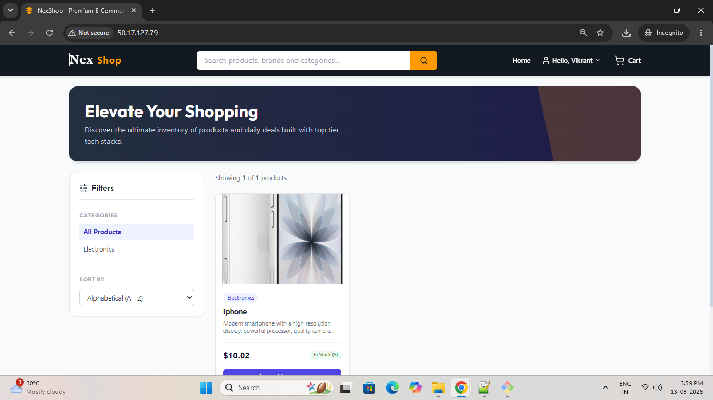

### Product Details

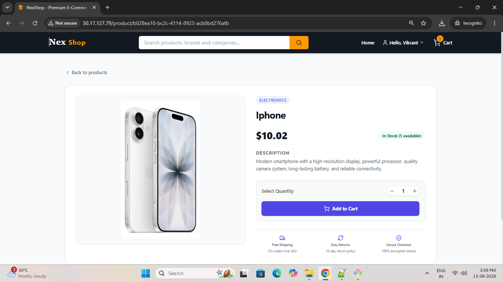

### User Login

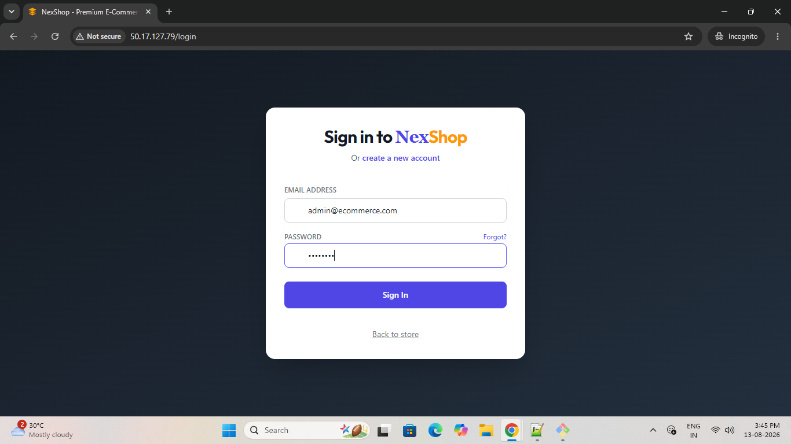

### Shopping Cart

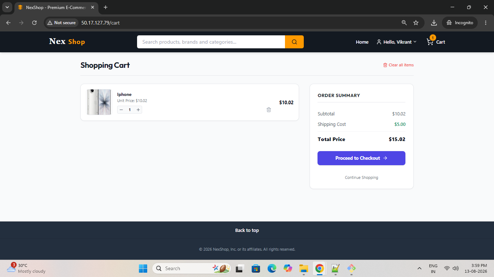

### Checkout

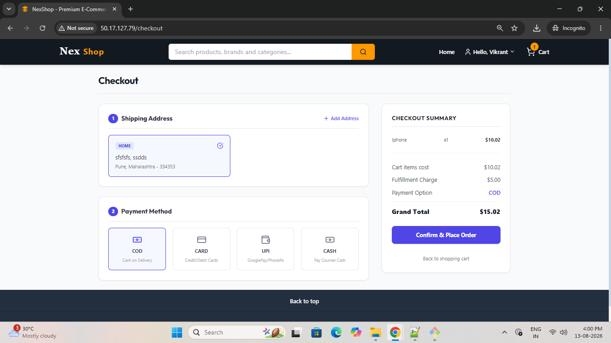

### My Orders / Order History

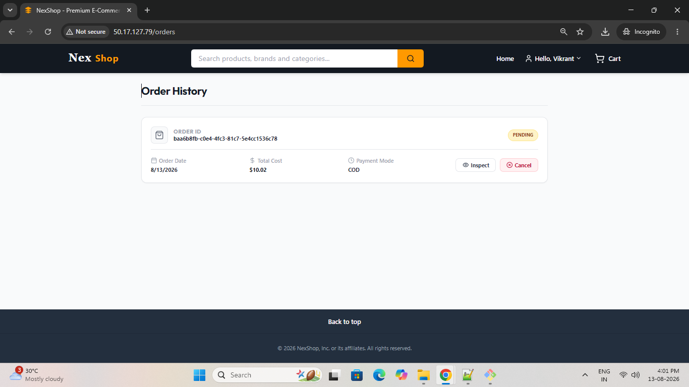

### Track Order

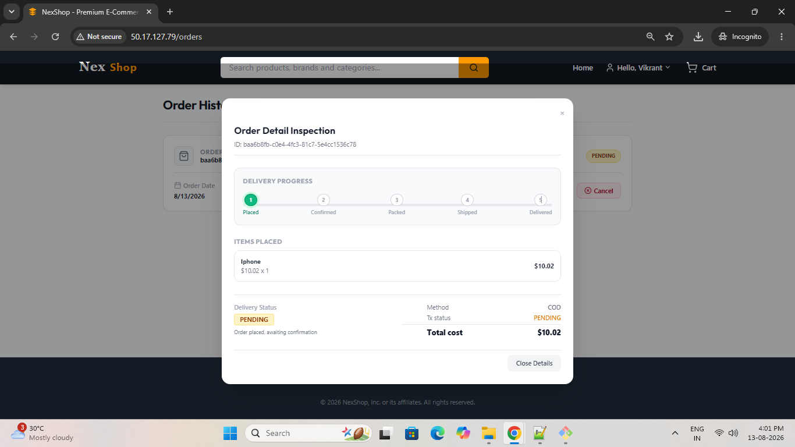

---

## Admin Screens

### Admin Dashboard

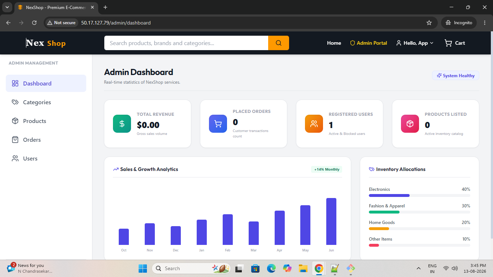

### Product Management

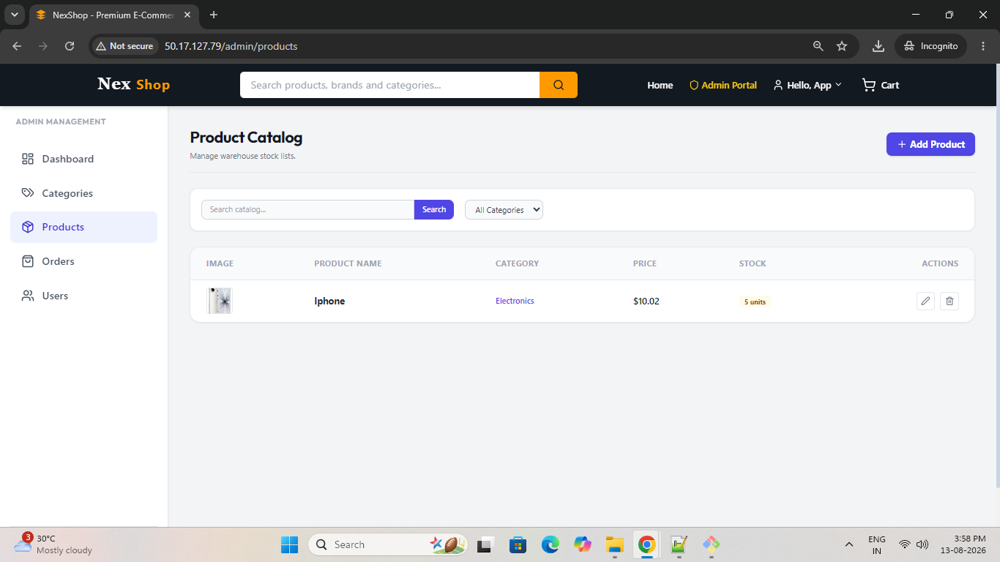

### Category Management

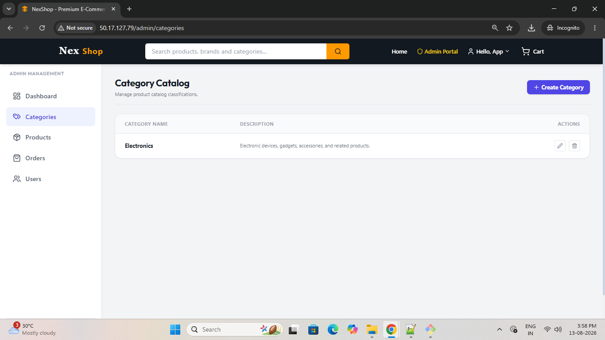

### Order Management

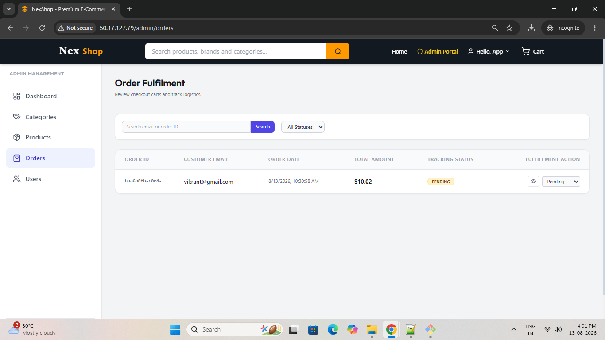

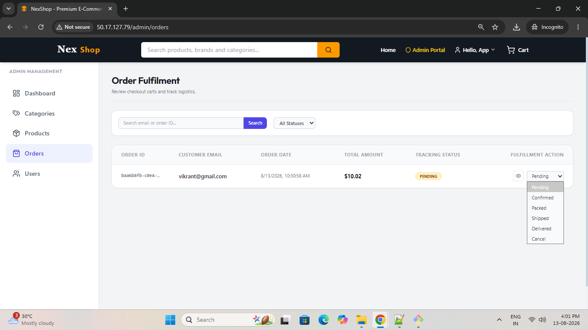

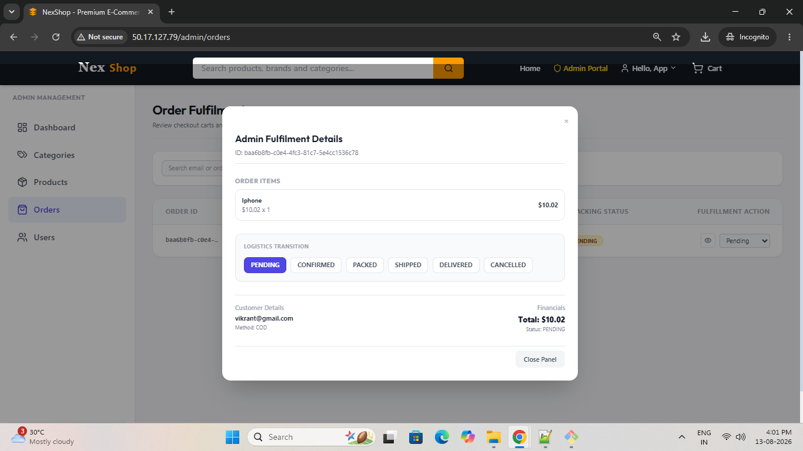

### User Management

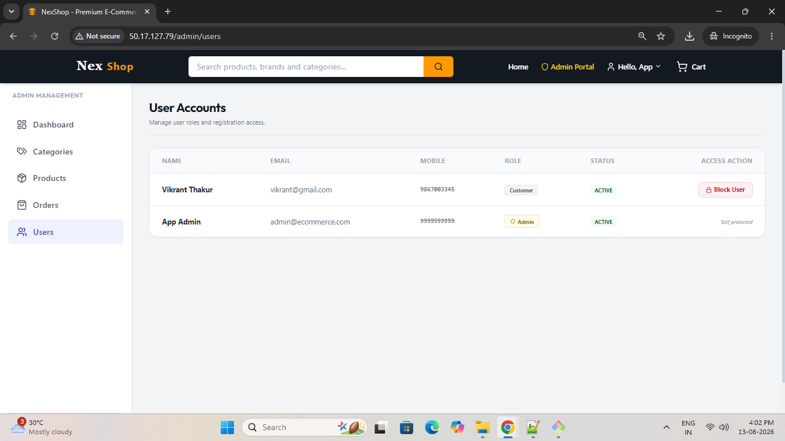

---

# 🏗️ Architecture

```text
                         ┌───────────────────────┐
                         │      User Browser     │
                         └───────────┬───────────┘
                                     │
                                     │ HTTP :80
                                     ▼
                         ┌───────────────────────┐
                         │        Nginx          │
                         │   React Static Files  │
                         └───────────┬───────────┘
                                     │
                                     │ API Requests
                                     │ :8080/api/v1
                                     ▼
                         ┌───────────────────────┐
                         │    Spring Boot API    │
                         │ Java 21 / Security    │
                         │ JWT / REST / JPA      │
                         └───────────┬───────────┘
                                     │
                                     │ JDBC :3306
                                     ▼
                         ┌───────────────────────┐
                         │        MySQL          │
                         │    ecommerce_db       │
                         └───────────────────────┘
```

---

# 📂 Project Structure

```text
ecommerce-platform/
│
├── backend/
│   ├── src/
│   ├── pom.xml
│   └── target/
│
├── database/
│   ├── schema.sql
│   └── seed.sql
│
├── frontend/
│   ├── src/
│   ├── public/
│   ├── package.json
│   ├── vite.config.js
│   ├── nginx.conf
│   └── dist/
│
├── docker-compose.yml
└── README.md
```

---

# 🚀 Tech Stack

## Frontend

- React.js
- Axios
- Bootstrap
- Vite
- JavaScript

## Backend

- Java 21
- Spring Boot 3
- Spring Security
- Spring Data JPA
- JWT Authentication
- REST APIs
- Maven

## Database

- MySQL 8+

## Deployment

- AWS EC2
- Amazon Linux
- Nginx
- Spring Boot Executable JAR
- Git

---

# ⚙️ Prerequisites

For local development:

- Java 21
- Maven 3.9+
- Node.js 20+
- npm
- MySQL 8+
- Git

For AWS deployment:

- AWS Account
- EC2 Instance
- Security Group
- Public IPv4 address
- SSH access

---

# 🗄️ Database Setup

Create the database:

```sql
CREATE DATABASE ecommerce_db;
```

Import the schema:

```bash
mysql -u root -p ecommerce_db < database/schema.sql
```

Import seed data:

```bash
mysql -u root -p ecommerce_db < database/seed.sql
```

Verify:

```sql
USE ecommerce_db;
SHOW TABLES;
```

Example:

```sql
SELECT * FROM user_master;
```

---

# 🔐 Default Admin Credentials

> Use only for development/demo purposes. Change the credentials before using the application in a real production environment.

**Email**

```text
admin@ecommerce.com
```

**Password**

```text
admin123
```

---

# ▶️ Local Backend Setup

Navigate to backend:

```bash
cd backend
```

Run with Maven:

```bash
mvn spring-boot:run
```

Or build a production JAR:

```bash
mvn clean package
```

Run the generated JAR:

```bash
java -jar target/ecommerce-platform-0.0.1-SNAPSHOT.jar
```

Backend URL:

```text
http://localhost:8080/api/v1
```

Swagger:

```text
http://localhost:8080/api/v1/swagger-ui/index.html
```

---

# 💻 Local Frontend Setup

Navigate to frontend:

```bash
cd frontend
```

Install dependencies:

```bash
npm install
```

Start the development server:

```bash
npm run dev
```

Frontend URL:

```text
http://localhost:5173
```

Create a production build:

```bash
npm run build
```

Production files are generated inside:

```text
frontend/dist/
```

---

# ☁️ AWS EC2 Deployment

This project was deployed on an **AWS EC2 instance** using:

```text
React Production Build → Nginx
Spring Boot → Executable JAR
MySQL → EC2
```

## 1. Launch EC2 Instance

Create an EC2 instance using Amazon Linux.

Configure the Security Group with the following inbound rules:

| Type | Port | Purpose |
|---|---:|---|
| SSH | 22 | EC2 administration |
| HTTP | 80 | Nginx / React frontend |
| Custom TCP | 8080 | Spring Boot API |

> For a production deployment, exposing Spring Boot directly on port 8080 is usually avoided. Nginx reverse proxy can be used so the backend remains private.

Connect through SSH:

```bash
ssh -i your-key.pem ec2-user@<EC2_PUBLIC_IP>
```

---

# 2. Install Required Packages

Install Nginx, MariaDB, Git, Node.js, Java 21, and Maven:

```bash
sudo dnf install -y nginx mariadb105-server git nodejs java-21-amazon-corretto-devel maven
```

OR 

```bash
sudo yum install nginx mariadb105-server git nodejs java-21-amazon-corretto-devel maven -y
```

Verify installations:

```bash
node -v
npm -v
java -version
mvn -version
```

Verify that Maven is using Java 21:

```bash
mvn -version
```

Expected:

```text
Maven home: /usr/share/maven
Java version: 21.x
Java home: /usr/lib/jvm/java-21-amazon-corretto.x86_64
```

### If Maven is using Java 17

Set Java 21 for the current shell:

```bash
export JAVA_HOME=/usr/lib/jvm/java-21-amazon-corretto.x86_64
export PATH=$JAVA_HOME/bin:$PATH
```

Verify again:

```bash
mvn -version
```

To make it persistent:

```bash
echo 'export JAVA_HOME=/usr/lib/jvm/java-21-amazon-corretto.x86_64' >> ~/.bashrc
echo 'export PATH=$JAVA_HOME/bin:$PATH' >> ~/.bashrc
source ~/.bashrc
```

---

# 3. Start Nginx and MySQL

```bash
sudo systemctl start nginx
sudo systemctl start mariadb
```

Enable them at boot:

```bash
sudo systemctl enable nginx
sudo systemctl enable mariadb
```

Check services:

```bash
sudo systemctl status nginx
sudo systemctl status mariadb
```

Press `q` to exit the status screen.

---

# 4. Clone the GitHub Repository

```bash
git clone https://github.com/devvikrantthakur/ecommerce-platform.git
```

Verify:

```bash
ls
```

Navigate to the project:

```bash
cd ~/ecommerce-platform
ls
```

Expected:

```text
README.md
backend
database
docker-compose.yml
frontend
```

---

# 5. Configure MySQL

Open MySQL:

```bash
sudo mysql
```

Set the root password:

```sql
ALTER USER root@localhost IDENTIFIED BY 'admin';
```

Exit:

```sql
exit;
```

Login using the password:

```bash
sudo mysql -u root -p
```

Enter the configured password.

Create the database:

```sql
CREATE DATABASE ecommerce_db;
```

Verify:

```sql
SHOW DATABASES;
```

Exit:

```sql
exit;
```

---

# 6. Import Database Schema and Seed Data

Navigate to the database folder:

```bash
cd ~/ecommerce-platform/database
ls
```

Import schema:

```bash
mysql -u root -p ecommerce_db < schema.sql
```

Import seed data:

```bash
mysql -u root -p ecommerce_db < seed.sql
```

Verify the database:

```bash
sudo mysql -u root -p
```

Then:

```sql
SHOW DATABASES;

USE ecommerce_db;

SHOW TABLES;

SELECT * FROM user_master;
```

---

# 7. Configure Spring Boot Backend

Navigate to the backend:

```bash
cd ~/ecommerce-platform/backend
```

Check the application configuration:

```bash
find src -type f | grep -E "application.properties|application.yml"
```

View the configuration:

```bash
cat src/main/resources/application.yml
```

The application is configured to use MySQL:

```yaml
spring:
  datasource:
    url: jdbc:mysql://localhost:3306/ecommerce_db
    username: root
    password: admin
```

> Update the credentials to match the MySQL credentials configured on your EC2 instance.

The backend listens on:

```yaml
server:
  port: 8080
  servlet:
    context-path: /api/v1
```

Therefore:

```text
Backend Base URL:
http://<EC2_PUBLIC_IP>:8080/api/v1
```

---

# 8. Configure Production CORS

The frontend production origin must be allowed by the Spring Boot CORS configuration.

Open:

```bash
cd ~/ecommerce-platform/backend
nano src/main/java/com/ecommerce/platform/security/SecurityConfig.java
```

Update the allowed origins:

```java
configuration.setAllowedOrigins(Arrays.asList(
    "http://localhost:5173",
    "http://localhost:3000",
    "http://<EC2_PUBLIC_IP>"
));
```

Replace `<EC2_PUBLIC_IP>` with the public IPv4 address of your EC2 instance.

For example:

```java
configuration.setAllowedOrigins(Arrays.asList(
    "http://localhost:5173",
    "http://localhost:3000",
    "http://50.17.127.79"
));
```

---

# 10. Build the Spring Boot Application

From the backend directory:

```bash
cd ~/ecommerce-platform/backend
```

Build:

```bash
mvn clean package -DskipTests
```

Successful build:

```text
BUILD SUCCESS
```

Verify the JAR:

```bash
ls target/
```

Expected:

```text
ecommerce-platform-0.0.1-SNAPSHOT.jar
```

---

# 11. Run Spring Boot Backend

Test the JAR:

```bash
java -jar target/ecommerce-platform-0.0.1-SNAPSHOT.jar
```

Look for:

```text
Tomcat started on port 8080
Started PlatformApplication
```

Stop the foreground process when required:

```text
Ctrl + C
```

Run in the background:

```bash
nohup java -jar target/ecommerce-platform-0.0.1-SNAPSHOT.jar > backend.log 2>&1 &
```

View logs:

```bash
tail -f backend.log
```

Verify that port 8080 is listening:

```bash
sudo ss -ltnp | grep :8080
```

> For a production-ready deployment, the JAR should ideally be managed by a `systemd` service so it automatically restarts after a reboot.

---

# 12. Test the Backend API

Backend base URL:

```text
http://<EC2_PUBLIC_IP>:8080/api/v1
```

Example:

```text
http://50.17.127.79:8080/api/v1
```

Protected endpoints may return:

```json
{
  "success": false,
  "message": "Unauthorized access: Full authentication is required to access this resource"
}
```

This indicates that the request reached Spring Security but authentication is required.

Swagger:

```text
http://<EC2_PUBLIC_IP>:8080/api/v1/swagger-ui/index.html
```

---

# 13. Configure React Frontend for AWS

Navigate to the frontend:

```bash
cd ~/ecommerce-platform/frontend
```

Find localhost, port, and API references:

```bash
grep -RniE "localhost|127\.0\.0\.1|8080|http://" src
```

The API configuration is located at:

```text
cd src/services/
```

```text
ls
```

Edit:

```bash
sudo vim api.js
```

Change:

```javascript
baseURL: 'http://localhost:8080/api/v1',
```

to:

```javascript
baseURL: 'http://<EC2_PUBLIC_IP>:8080/api/v1',
```

Example:

```javascript
baseURL: 'http://50.17.127.79:8080/api/v1',
```

Verify:

```bash
cat src/services/api.js
```

---

# 14. Install Frontend Dependencies

```bash
cd ~/ecommerce-platform/frontend
npm install
```

>Note: Prefer running npm as the normal `ec2-user`. Avoid `sudo npm install` where possible because it can make `node_modules` root-owned and cause `EACCES` permission errors later.

If `node_modules` was previously created using `sudo`, fix its ownership:

```bash
sudo chown -R ec2-user:ec2-user ~/ecommerce-platform/frontend
```

If necessary, reinstall dependencies:

```bash
rm -rf node_modules
npm install
```

---

# 15. Create the React Production Build

```bash
npm run build
```

A successful Vite build generates:

```text
dist/
├── index.html
└── assets/
```

Verify:

```bash
ls
```

---

# 17. Deploy React Build to Nginx

Remove the default Nginx page:

```bash
sudo rm -rf /usr/share/nginx/html/*
```

Copy the production build:

```bash
sudo cp -r ~/ecommerce-platform/frontend/dist/* /usr/share/nginx/html/
```

Verify:

```bash
ls -la /usr/share/nginx/html/
```

Expected:

```text
index.html
assets/
```

Restart Nginx:

```bash
sudo systemctl restart nginx
```

Enable Nginx at boot:

```bash
sudo systemctl enable nginx
```

---

# 18. Open the Application

Open the EC2 public IPv4 address in a browser:

```text
http://<EC2_PUBLIC_IP>
```

Example:

```text
http://50.17.127.79
```

The React application should now be served by Nginx.

---

# 🔄 Deployment Flow

The complete deployment flow is:

```text
GitHub Repository
       │
       ▼
   AWS EC2
       │
       ├── MySQL
       │     └── ecommerce_db
       │
       ├── Spring Boot
       │     └── Java 21 / Port 8080
       │
       ├── React
       │     └── npm run build → dist/
       │
       └── Nginx
             └── Port 80
```

---

# 👤 User Application Flow

```text
Sign Up
   ↓
Login
   ↓
Browse Products
   ↓
View Product Details
   ↓
Add to Cart
   ↓
Add / Select Address
   ↓
Checkout
   ↓
Place Order
   ↓
View Orders
   ↓
Track Order
```

---

# 👨‍💼 Admin Application Flow

```text
Admin Login
     ↓
Admin Dashboard
     │
     ├── Product Management
     │     ├── Create
     │     ├── Read
     │     ├── Update
     │     └── Delete
     │
     ├── Category Management
     │     ├── Create
     │     ├── Read
     │     ├── Update
     │     └── Delete
     │
     ├── Order Management
     │     ├── View Orders
     │     └── Update Order Status
     │
     └── User Management
           ├── View Users
           └── Manage Users
```

---

# 🧪 Deployment Verification Checklist

After deployment, verify:

- [ ] EC2 instance is running
- [ ] Security Group allows SSH (22)
- [ ] Security Group allows HTTP (80)
- [ ] Security Group allows backend port (8080) for the current architecture
- [ ] MySQL/MariaDB is running
- [ ] `ecommerce_db` exists
- [ ] Schema imported successfully
- [ ] Seed data imported successfully
- [ ] Spring Boot JAR starts successfully
- [ ] Port 8080 is listening
- [ ] Frontend `dist/` created successfully
- [ ] Nginx configuration passes `nginx -t`
- [ ] Nginx is running
- [ ] React application opens through EC2 public IP
- [ ] User signup/login works
- [ ] Product listing works
- [ ] Cart works
- [ ] Checkout works
- [ ] Order history works
- [ ] Order tracking works
- [ ] Admin login works
- [ ] Admin CRUD operations work

---

# 📝 Important Deployment Notes

### EC2 Public IP

The EC2 public IPv4 address can change after stopping and starting an instance unless an Elastic IP is associated with it.

For a more stable deployment, use:

- AWS Elastic IP
- Route 53 / Domain Name
- HTTPS with SSL/TLS
- Nginx reverse proxy
- Backend kept private instead of exposing port 8080 publicly

### Current API Architecture

The current deployment uses:

```text
React
  ↓
http://<EC2_PUBLIC_IP>:8080/api/v1
  ↓
Spring Boot
```

For a more production-oriented architecture, Nginx can proxy `/api` to Spring Boot:

```text
Browser
   ↓
Nginx :80 / :443
   ├── React frontend
   └── /api → Spring Boot :8080
                  ↓
                MySQL
```

This removes the need to expose Spring Boot directly to the internet.

---

# 📌 Future Enhancements

- Docker
- Docker Compose
- Jenkins CI/CD
- GitHub Actions
- Kubernetes
- Terraform
- AWS RDS
- AWS S3
- Elastic Load Balancer
- Auto Scaling
- Route 53
- HTTPS / SSL
- Nginx reverse proxy
- Private subnet for backend
- AWS Secrets Manager

---

# 🔗 GitHub Repository
[Java Full Stack E-Commerce Platform - GitHub](https://github.com/devvikrantthakur/ecommerce-platform)

---

# 👨‍💻 Author

**Vikrant Thakur**

[GitHub Profile](https://github.com/devvikrantthakur)  

